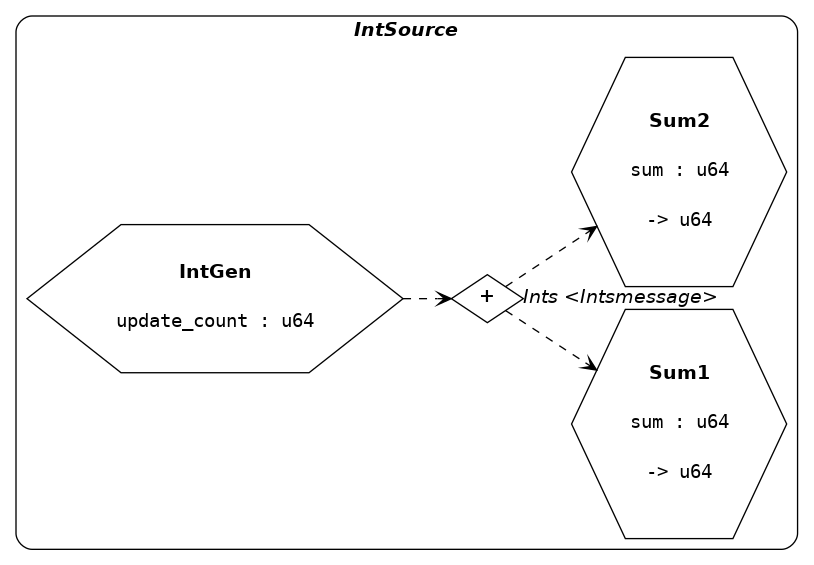
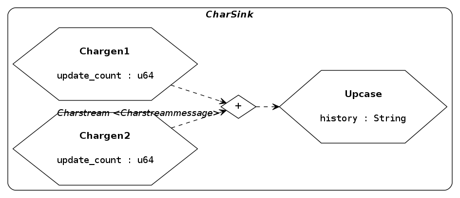
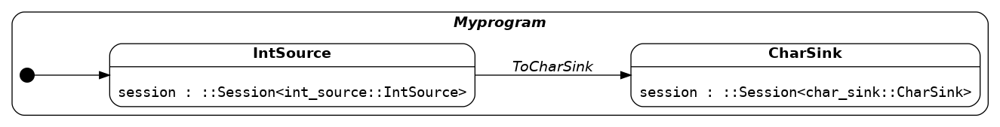
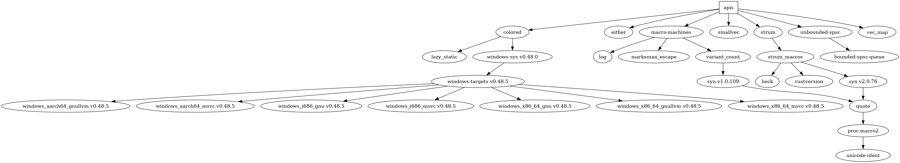

# Apis

> Reactive, session-oriented, asynchronous process-calculus framework

[Documentation](https://docs.rs/apis/)

This crate provides traits and a macro interface for defining *sessions* of
reactive threads ("*processes*" in the sense of 'process calculus'),
communicating messages over a fixed topology of *channels*. It also provides a
macro for defining a "*program*" as a state transition system on session
nodes, called "*modes*", in which thread-local state may be passed from
processes of one mode to the next.


**Current features**

- Initialization-time validation of process and channel connectivity and
  consistency within a session
- Asynchronous sends and unbounded channels
- Three kinds of channels classified by connection topology:
    * 'Simplex' -- a one-way SPSC stream
    * 'Sink' -- a standard MPSC channel
    * 'Source' -- an SPMC unicast channel
- Four kinds of processes with varying receive and update behavior, roughly
  divided into two classes by receive mechanism:
    * "asynchronous" -- block-waiting receives for a single endpoint
      ('Asynchronous')
    * "synchronous" -- polling loops on any number of endpoints with various
      timing schemes ('Isochronous', 'Mesochronous', 'Anisochronous')
- Logging of events using the `log` logging API
- Graphviz DOT file output for session data flow diagrams and program state
  transition diagrams.


**Current limitations**

- Process and channel definitions are local to a particular session definition;
  they cannot be re-used. One way to partly mitigate this limitation is to
  create a context type that encapsulates the intended 'role' and re-use that
  in multiple processes.
- Passing state between sessions is implemented in a *continuation-passing
  style* and the Rust compiler cannot optimize away the tail recursion in this
  case; note this only occurs if state is explicitly transferred between
  sessions, otherwise unaffected threads will join back with the main thread
  and no tail recursion will take place.


## Usage

The features of this library are implemented using two top-level macro
definitions, `def_session!` and `def_program!`, to define sessions and
programs, respectively.


**Sessions**

The `def_session!` macro expands to datatype and function implementations
defining processes, channels, and messages.

*Example*

Define a session 'IntSource' in which a source thread sends `u64` values
alternatively to two peers which sum the received values and return a final sum
in the *session result*:

```rust
#[macro_use] extern crate apis;

pub mod int_source {
  use ::apis;

  const MAX_UPDATES : u64 = 10;

  def_session!{
    context IntSource {
      PROCESSES where
        let process    = self,
        let message_in = message_in
      [
        process IntGen (update_count : u64) {
          kind { apis::process::Kind::Isochronous { tick_ms: 20, ticks_per_update: 1 } }
          sourcepoints   [Ints]
          endpoints      []
          handle_message { unreachable!() }
          update         { process.int_gen_update() }
        }
        process Sum1 (sum : u64) -> (u64) {
          kind           { apis::process::Kind::asynchronous_default() }
          sourcepoints   []
          endpoints      [Ints]
          handle_message { process.sum1_handle_message (message_in) }
          update         { apis::process::ControlFlow::Continue }
        }
        process Sum2 (sum : u64) -> (u64) {
          kind           { apis::process::Kind::asynchronous_default() }
          sourcepoints   []
          endpoints      [Ints]
          handle_message { process.sum2_handle_message (message_in) }
          update         { apis::process::ControlFlow::Continue }
        }
      ]
      CHANNELS  [
        channel Ints <Intsmessage> (Source) {
          producers [IntGen]
          consumers [Sum1, Sum2]
        }
      ]
      MESSAGES [
        message Intsmessage {
          Anint (u64),
          Quit
        }
      ]
    }
  }

  impl IntGen {
    pub fn int_gen_update (&mut self) -> apis::process::ControlFlow {
      use apis::Process;
      use num::FromPrimitive;
      let to_id = (self.update_count % 2) + 1;
      let anint = self.update_count;
      let mut result = self.send_to (
        ChannelId::Ints,
        ProcessId::from_u64 (to_id).unwrap(),
        Intsmessage::Anint (anint)
      ).into();
      self.update_count += 1;
      if result == apis::process::ControlFlow::Break || MAX_UPDATES < self.update_count {
        // quit
        let _ = self.send_to (ChannelId::Ints, ProcessId::Sum1, Intsmessage::Quit);
        let _ = self.send_to (ChannelId::Ints, ProcessId::Sum2, Intsmessage::Quit);
        result = apis::process::ControlFlow::Break
      }
      result
    }
  }

  impl Sum1 {
    fn sum1_handle_message (&mut self, message : GlobalMessage) -> apis::process::ControlFlow {
      match message {
        GlobalMessage::Intsmessage (Intsmessage::Anint (anint)) => {
          self.sum += anint;
          apis::process::ControlFlow::Continue
        }
        GlobalMessage::Intsmessage (Intsmessage::Quit) => {
          self.result = self.sum;
          apis::process::ControlFlow::Break
        }
      }
    }
  }

  impl Sum2 {
    fn sum2_handle_message (&mut self, message : GlobalMessage) -> apis::process::ControlFlow {
      match message {
        GlobalMessage::Intsmessage (Intsmessage::Anint (anint)) => {
          self.sum += anint;
          apis::process::ControlFlow::Continue
        }
        GlobalMessage::Intsmessage (Intsmessage::Quit) => {
          self.result = self.sum;
          apis::process::ControlFlow::Break
        }
      }
    }
  }
}

fn main() {
  use int_source::*;
  use apis::session::Context;
  // verifies the validity of the session definition
  let session_def = IntSource::def().unwrap();
  // create the session in the 'Ready' state
  let mut session : apis::Session <IntSource> = session_def.into();
  // run the session and collect results
  let results = session.run();
  println!("results: {:?}", results);
}
```

Note that it is necessary to introduce variable identifiers (here `process` and
`message_in`) in the session definition so that they can be referred to in
`handle_message` and `update` blocks, or in optional `initialize` and
`terminate` blocks (not shown). Here the identifier `process` will be made a
mutable self reference to the local process in each block, and `message_in`
will be made an alias for the received message in the scope of `handle_message`
blocks only.

Generate a graphviz DOT file representing the session data flow diagram and
write to file:

```rust
  let session_def = IntSource::def().unwrap();
  use std::io::Write;
  let mut f = std::fs::File::create ("intsource.dot").unwrap();
  f.write_all (session_def.dotfile().as_bytes()).unwrap();
  drop (f);
```

Rendered as PNG with `$ dot -Tpng intsource.dot > intsource.png`:

[](intsource.png)

Note that sessions define a number of types in the scope where the macro is
invoked. Putting each session in its own module allows them to be sequentially
composed into "*programs*", described next.


**Programs**

*Example*

Define another session `CharSink` in module `char_sink` with different behavior
and reversed message flow (implementation omitted, see `./examples/readme.rs`):

[](charsink.png)

A *program* can then be defined which runs both sessions sequentially:

```rust
def_program! {
  program Myprogram where let result = session.run() {
    MODES [
      mode int_source::IntSource {
        use apis::Process;
        let sum1 = int_source::Sum1::extract_result (&mut result).unwrap();
        let sum2 = int_source::Sum2::extract_result (&mut result).unwrap();
        println!("combined sums: {}", sum1 + sum2);
        Some (EventId::ToCharSink)
      }
      mode char_sink::CharSink
    ]
    TRANSITIONS  [
      transition ToCharSink <int_source::IntSource> => <char_sink::CharSink>
    ]
    initial_mode: IntSource
  }
}

fn main() {
  use apis::Program;
  // create a program in the initial mode
  let mut myprogram = Myprogram::initial();
  // run to completion
  myprogram.run();
}
```

Note that it is necessary to introduce the `result` identifier here to access
the result of a `session.run()` call within the (optional) 'transition
choice block' associated to a mode, in this case 'IntSource'. Here the
transition is always the same, however the contents of the session result can
be used to nondeterministically choose any transition with a source matching
the finished session. If no transition choice block is defined (as is the case
with 'CharSink' above), or if a transition choice block evaluates to 'None',
then the program will exit and not transition to any other session.

For examples of programs that transfer state from processes of one session to
the next, see `program.rs`, `interactive.rs`, or `graphical.rs` in the
`./examples/` directory.

A program is implemented as a state machine for which a DOT file can be
generated showing the program state transition system:

```rust
  use std::io::Write;
  let mut f = std::fs::File::create ("myprogram.dot").unwrap();
  f.write_all (Myprogram::dotfile().as_bytes()).unwrap();
  drop (f);
```

[](myprogram.png)


### Logging

The `log` crate is used to provide log messages at various levels which are
ignored unless a logging implementation is selected, for example `simplelog`:

```toml
[dependencies]
simplelog = "0.6.*"
```

Using a `TermLogger` to display log messages in the terminal:

```rust
extern crate simplelog;
fn main() {
  simplelog::TermLogger::init (
    simplelog::LevelFilter::Debug,
    simplelog::Config::default(),
    simplelog::TerminalMode::Stdout
  ).unwrap();
  // ...
}
```

## Examples

A number of example programs are given in `./examples/`. Non-interactive
examples can be run by the `./run-examples.sh` script which will also builds
images from generated DOT files. The `graphical.rs` and `interactive.rs`
examples are interactive, requiring user input. These can be run with the
`./run-interactive.sh` script which will also produce images from the generated
DOT files for these examples.

Most of these examples will intentionally generate warnings, see the doc
comments of individual examples for specifics.


## Running tests

Doctests of process and channel definitions need to be run with `--features
"test"` to compile successfully:

```
$ cargo test --features "test"
```

(see <https://github.com/rust-lang/rust/issues/45599>).


## Dependencies


