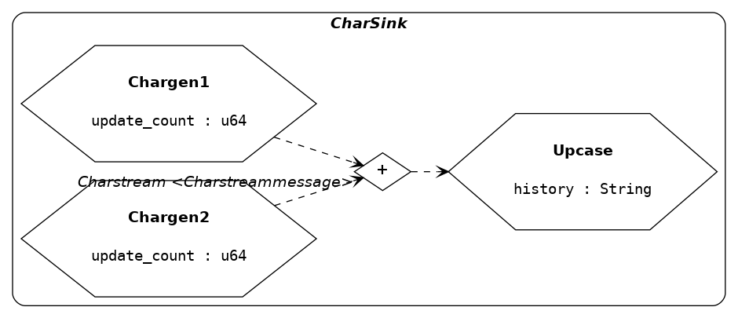

# Apis

> Reactive session-oriented asynchronous process-calculus framework

[Documentation](https://spearman.github.io/apis/apis/index.html)

This crate defines traits and macros for defining *sessions* of reactive
threads (here called "*processes*" in the sense of process calculus)
communicating messages on a fixed topology of *channels*, and also for defining
*programs* as transition systems where nodes are sessions (in this context
referred to as "*modes*").


## Usage

**Dependencies**

The macros used for defining sessions and programs expand to datatype and
function implementations that depend on a number of support libraries which
should be declared in the `Cargo.toml` manifest of any crate using `apis`:

```toml
[dependencies]
apis = { version = "0.0.*", git = "git://github.com/spearman/apis.git" }
macro-machines = { version = "0.2.*", git = "git://github.com/spearman/macro-machines.git" }
enum-unitary = { version = "0.1.*", git = "git://github.com/spearman/enum-unitary.git" }

colored = "1.*"
either = "1.*"
enum_derive = "0.1.*"
escapade = "0.0.*"
log = "0.4.*"
macro-attr = "0.2.*"
num = "0.1.*"
vec_map = "0.8.*"
```

and a number of unstable features in the crate root:

```rust
#![feature(const_fn)]
#![feature(core_intrinsics)]
#![feature(fnbox)]
#![feature(try_from)]
```

The dependencies above should then be made available:

```rust
#[macro_use] extern crate apis;
#[macro_use] extern crate macro_machines;
#[macro_use] extern crate enum_unitary;

#[macro_use] extern crate enum_derive;
#[macro_use] extern crate log;
#[macro_use] extern crate macro_attr;
extern crate colored;
extern crate either;
extern crate escapade;
extern crate num;
extern crate vec_map;
```


**Sessions**

Define and run a session:

```rust
/// A session in which a source thread sends `u64` values alternatively to two
/// peers which sum the received values and return a final sum in the session
/// result.
pub mod int_source {
  use ::std;
  use ::vec_map;
  use ::apis;

  const MAX_UPDATES : u64 = 10;

  def_session!{
    context IntSource {
      PROCESSES where
        let _proc       = self,
        let _message_in = message_in
      [
        process IntGen (update_count : u64) {
          kind { apis::process::Kind::Isochronous { tick_ms: 20, ticks_per_update: 1 } }
          sourcepoints   [Ints]
          endpoints      []
          handle_message { unreachable!() }
          update         { _proc.int_gen_update() }
        }
        process Sum1 (sum : u64) -> (u64) {
          kind           { apis::process::Kind::asynchronous_default() }
          sourcepoints   []
          endpoints      [Ints]
          handle_message { _proc.sum1_handle_message (_message_in) }
          update         { apis::process::ControlFlow::Continue }
        }
        process Sum2 (sum : u64) -> (u64) {
          kind           { apis::process::Kind::asynchronous_default() }
          sourcepoints   []
          endpoints      [Ints]
          handle_message { _proc.sum2_handle_message (_message_in) }
          update         { apis::process::ControlFlow::Continue }
        }
      ]
      CHANNELS  [
        channel Ints <Intsmessage> (Source) {
          producers [IntGen]
          consumers [Sum1, Sum2]
        }
      ]
      MESSAGES [
        message Intsmessage {
          Anint (u64),
          Quit
        }
      ]
    }
  }

  impl IntGen {
    pub fn int_gen_update (&mut self) -> apis::process::ControlFlow {
      use apis::Process;
      use num::FromPrimitive;
      let to_id = (self.update_count % 2) + 1;
      let anint = self.update_count;
      let mut result = self.send_to (
        ChannelId::Ints,
        ProcessId::from_u64 (to_id).unwrap(),
        Intsmessage::Anint (anint)
      ).into();
      self.update_count += 1;
      if result == apis::process::ControlFlow::Break || MAX_UPDATES < self.update_count {
        // quit
        let _ = self.send_to (ChannelId::Ints, ProcessId::Sum1, Intsmessage::Quit);
        let _ = self.send_to (ChannelId::Ints, ProcessId::Sum2, Intsmessage::Quit);
        result = apis::process::ControlFlow::Break
      }
      result
    }
  }

  impl Sum1 {
    fn sum1_handle_message (&mut self, message : GlobalMessage) -> apis::process::ControlFlow {
      match message {
        GlobalMessage::Intsmessage (Intsmessage::Anint (anint)) => {
          self.sum += anint;
          apis::process::ControlFlow::Continue
        }
        GlobalMessage::Intsmessage (Intsmessage::Quit) => {
          self.result = self.sum;
          apis::process::ControlFlow::Break
        }
      }
    }
  }

  impl Sum2 {
    fn sum2_handle_message (&mut self, message : GlobalMessage) -> apis::process::ControlFlow {
      match message {
        GlobalMessage::Intsmessage (Intsmessage::Anint (anint)) => {
          self.sum += anint;
          apis::process::ControlFlow::Continue
        }
        GlobalMessage::Intsmessage (Intsmessage::Quit) => {
          self.result = self.sum;
          apis::process::ControlFlow::Break
        }
      }
    }
  }
}

fn main() {
  use int_source::*;
  use apis::session::Context;
  // verifies the validity of the session definition
  let session_def = IntSource::def().unwrap();
  // create the session in the 'Ready' state
  let mut session : apis::session::Session <IntSource> = session_def.into();
  // run the session and collect results
  let results = session.run();
  println!("results: {:?}", results);
}
```

Generate a graphviz dotfile and write to file:

```rust
  use std::io::Write;
  let mut f = std::fs::File::create ("intsource.dot").unwrap();
  f.write_all (IntSource::dotfile_hide_defaults().as_bytes()).unwrap();
  drop (f);
```

Rendered as PNG with `$ dot -Tpng intsource.dot > intsource.png`:

[](intsource.png)

Note that sessions define a number of types in the scope where the macro is
invoked. Putting each session in its own module allows them to be sequentially
composed into "*programs*", described next.


**Programs**

Define another session `CharSink` in module `char_sink` with different behavior
and reversed message flow (implementation omitted, see `./examples/readme.rs`):

[](charsink.png)

A *program* can then be defined which runs both sessions sequentially:

```rust
def_program! {
  program Myprogram where let _result = session.run() {
    MODES [
      mode int_source::IntSource {
        use apis::Process;
        let sum1 = int_source::Sum1::extract_result (&mut _result).unwrap();
        let sum2 = int_source::Sum2::extract_result (&mut _result).unwrap();
        println!("combined sums: {}", sum1 + sum2);
        Some (EventId::ToCharSink)
      }
      mode char_sink::CharSink
    ]
    TRANSITIONS  [
      transition ToCharSink <int_source::IntSource> => <char_sink::CharSink>
    ]
    initial_mode: IntSource
  }
}

fn main() {
  use apis::Program;
  // create a program in the initial mode
  let mut myprogram = Myprogram::initial();
  // run to completion
  myprogram.run();
}
```

Here the transition is always the same, however the results can be used to
nondeterministically choose any transition with a source matching the last
session.

A program is implemented as a state machine for which a dotfile can also be
generated:

```rust
  use std::io::Write;
  let mut f = std::fs::File::create ("myprogram.dot").unwrap();
  f.write_all (Myprogram::dotfile_hide_defaults().as_bytes()).unwrap();
  drop (f);
```

[](myprogram.png)


### Logging

The `log` crate is used to provide log messages at various levels which are
ignored unless a logging implementation is selected, for example `simplelog`:

```toml
[dependencies]
simplelog = "0.4.*"
```

Using a `TermLogger` to display log messages in the terminal:

```rs
extern crate simplelog;
fn main() {
  simplelog::TermLogger::init (
    simplelog::LevelFilter::Debug,
    simplelog::Config::default
  ).unwrap();
  // ...
}
```

## Examples

A number of example programs are given in `./examples/`. The `graphical.rs` and
`interactive.rs` examples are interactive, requiring user input, while the rest
can be run unattended. Some of these will intentionally generate warnings.


## Limitations

Mapping threads accross sessions involves continuation passing and Rust cannot
optimize the tail call meaning the stack will eventually overflow if too many
mapped transitions are triggered without joining back to the main thread at
some point.

